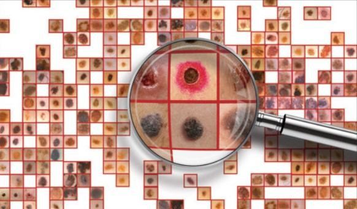

# Melanoma-Detection-using-Convolutional-Neural-Networks

## Problem Statement

The goal of this project is to build a CNN-based model to accurately detect melanoma, a type of cancer that can be deadly if not detected early. The model will evaluate images and alert dermatologists about the presence of melanoma, potentially reducing manual effort needed in diagnosis.

## Dataset

The dataset consists of 2357 images of malignant and benign oncological diseases, sourced from the International Skin Imaging Collaboration (ISIC). It includes the following diseases:

- Actinic keratosis
- Basal cell carcinoma
- Dermatofibroma
- Melanoma
- Nevus
- Pigmented benign keratosis
- Seborrheic keratosis
- Squamous cell carcinoma
- Vascular lesion

## Project Pipeline

1. **Data Reading/Data Understanding**: Define the path for train and test images.
2. **Dataset Creation**: Create train & validation dataset from the train directory with a batch size of 32. Resize images to 180x180.
3. **Dataset Visualization**: Visualize one instance of all nine classes present in the dataset.
4. **Model Building & Training**: 
   - Create a CNN model to detect the nine classes, rescaling images to normalize pixel values between (0,1).
   - Choose an appropriate optimizer and loss function.
   - Train the model for ~20 epochs and analyze for overfitting/underfitting.
5. **Data Augmentation**: Choose an appropriate data augmentation strategy to resolve overfitting/underfitting.
6. **Model Building & Training on Augmented Data**: Repeat steps for model training on augmented data.
7. **Class Distribution Analysis**: Examine the current class distribution in the training dataset.
   - Identify classes with the least number of samples.
   - Identify classes dominating the data in terms of proportionate number of samples.
8. **Handling Class Imbalances**: Rectify class imbalances in the training dataset using the Augmentor library.
9. **Model Building & Training on Rectified Class Imbalance Data**: Repeat steps for model training on rectified class imbalance data.

## Files

- `CNN_Assignment_Starter_Code.ipynb`: Jupyter notebook containing the starter code for the assignment.

## Getting Started

1. Download the dataset.
2. Open `CNN_Assignment_Starter_Code.ipynb` in Jupyter notebook.
3. Follow the project pipeline to build and train the CNN model.

## Results

- Findings after model fit for each training phase.
- Evaluation of model performance and resolution of issues like overfitting/underfitting.

## Conclusion

Summarize the project findings and the effectiveness of the CNN model in detecting melanoma.

